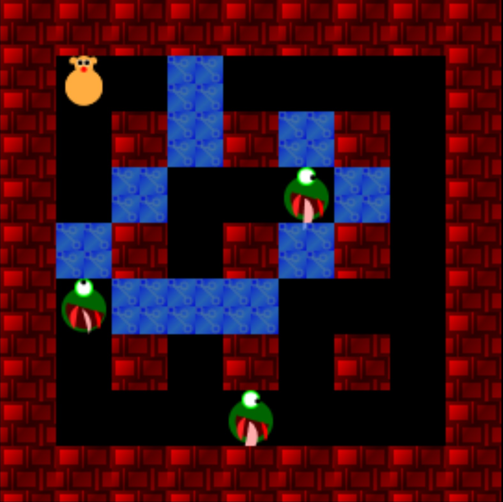
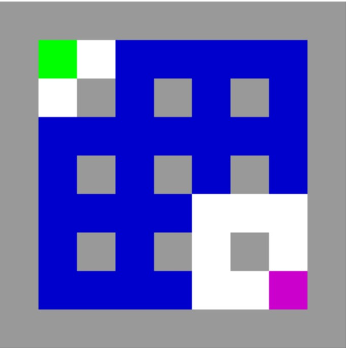

# bomb-guy

In this kata your task is to refactor the code for a small game. When finished it should be easier to implement suggested extensions below.

The code already abides by the most common principles "Don't Repeat Yourself", "Keep It Simple, Stupid", and there are only very few magic literals. There are no poorly structured nor deeply nested `if`s.

This is *not* an easy exercise.

New game style:

Original game style:

# Inspiration for extensions

1. Make bombs round ✅
2. Bomb range upgrade
3. Bombs trigger each other
4. Draw upgrades with images ✅
5. Add lives, incl. extra life upgrade
6. Add eyes to the monster so you can see which way it is facing ✅
7. Add more types of monsters
8. Add a slippery tile, when the player steps on it they go as far as they can in that direction
9. Make the fire not take up a whole tile, but still connects to fire next to it

# How to build it

Assuming that you have the Typescript compiler installed: Open a terminal in this directory, then run `tsc`. There should now be a `index.js` file in this directory.

# How to run it

To run the game first build it, see above. Since this uses JS modules, for security reasons `index.html` must be run on a webserver. Easiest way to run is by using JetBrains Rider to run the index.html. Use the arrow keys to move the player and spacebar to drop bombs.

# Thank you!

If you like this kata please consider giving the repo a star. You might also consider purchasing a copy of my book where I show a simple way to tackle code like this: [Five Lines of Code](https://www.manning.com/books/five-lines-of-code).

If you have feedback or comments on this repo don't hesitate to write me a message or send me a pull request.

Thank you for checking it out.